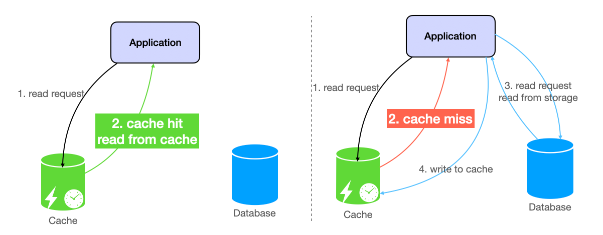
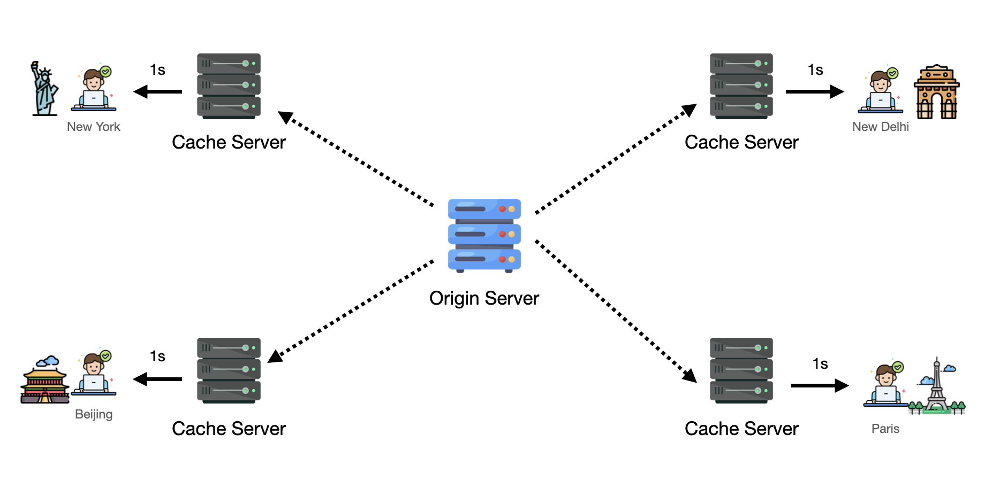
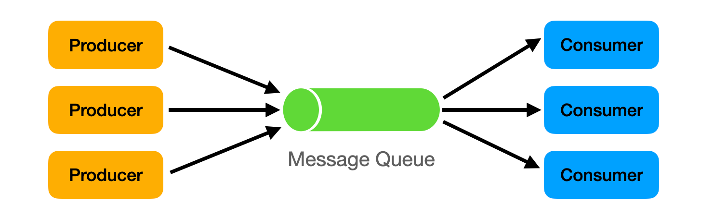
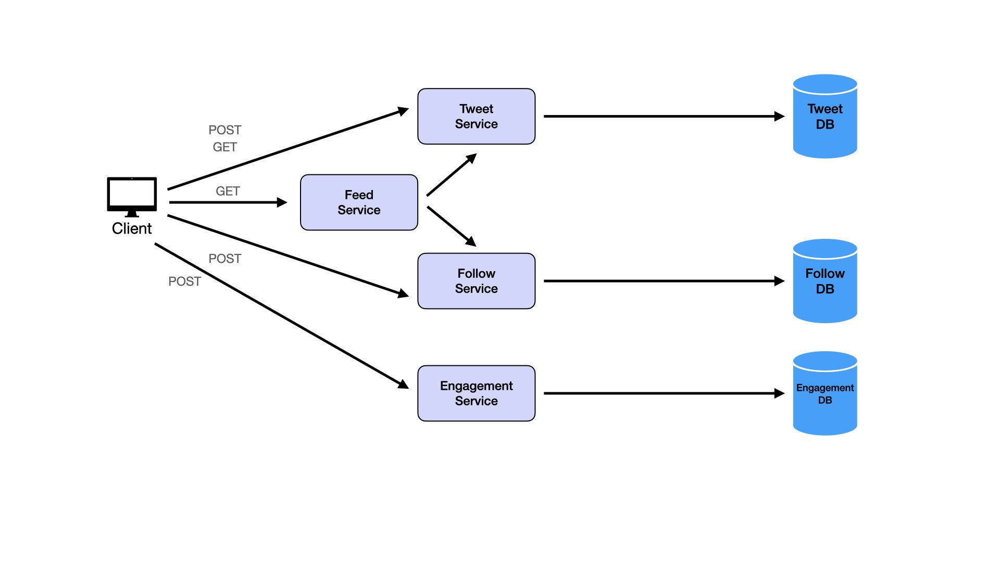
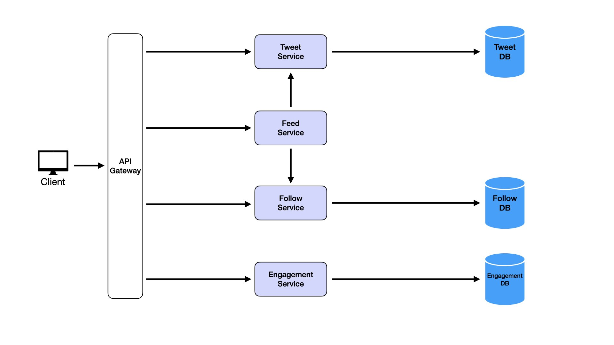
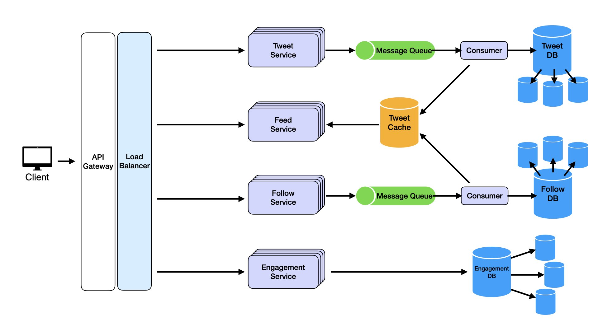
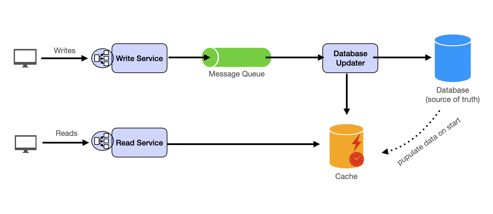

# System Design Primer: A Fun and Insightful Adventure into Scalable Systems! 🚀

This document provides a concise overview of the System Design Primer, serving as a condensed version of **https://systemdesignschool.io/primer**. Use it for quick reference or review, with detailed explanations available in the respective folders and their Markdown files.

---

## What is System Design? 🏗️

Picture this: you’re tasked with building the digital equivalent of a bustling metropolis like Google, Amazon, or Netflix. These platforms handle *billions* of users, *terabytes* of data, and traffic spikes that could make a rollercoaster jealous—all while staying fast, reliable, and secure. That’s system design in a nutshell!

System design is the art of creating a *blueprint* for applications or platforms. It’s about stitching together components like databases, APIs, caches, and load balancers to create a system that’s:

- **Scalable**: Can handle a sudden influx of users, like Black Friday shoppers storming an online store.
- **Reliable**: Stays up even if a server decides to take a nap.
- **Fast**: Delivers data faster than a barista serving coffee during the morning rush.
- **Cost-effective**: Balances performance with your budget (because nobody wants a bankrupt city!).

Think of system design as solving a giant puzzle where every piece (component) must fit perfectly, and you’re constantly balancing speed, cost, and reliability. It’s not just about making a feature work—it’s about making it work for *millions* of users without breaking a sweat. 😎

---

## Why System Design Matters 🎯

System design isn’t just for tech wizards at Big Tech companies—it’s what separates good engineers from *great* ones. Here’s why it’s a big deal:

1. **It’s a Job Interview Superpower**: System design interviews are a staple at companies like Google, Amazon, and Netflix. They test if you can think big and design systems that scale to galactic proportions.
2. **It’s the Key to Great Engineering**: Anyone can write code, but designing systems that handle millions of users? That’s the stuff of legends!

In a system design interview, you’re not just coding—you’re playing chess with tech components, making strategic moves to ensure your system is robust, scalable, and user-friendly. 🧩

---

## System Design Interviews: The Ultimate Challenge 🏆

Imagine you’re in a 45-minute showdown, tasked with designing Twitter, YouTube, or Uber from scratch. System design interviews test your ability to:

- **Solve Problems**: Break down a vague problem (e.g., “Design a URL shortener”) into manageable chunks.
- **Think Big**: Design systems that handle millions of users without crashing.
- **Balance Trade-offs**: Choose between speed, cost, or reliability based on the use case.
- **Communicate Clearly**: Explain your design like you’re telling a story to a friend, not a robot.
- **Adapt**: Pivot when the interviewer throws in curveballs like “What if traffic doubles overnight?”

It’s less about memorizing solutions and more about showing off your *problem-solving swagger*. Let’s dive into the key components that make up these digital cities! 🌆

---

## Core Components: The Building Blocks of Systems 🏠

Every system is built from reusable components, like LEGO bricks for tech. Here’s a fun breakdown of the main ones you’ll encounter in system design:

### Microservices: The Team of Superheroes 🦸‍♂️🦸‍♀️

Imagine a superhero team where each member has a unique power. Microservices are like that—small, independent services that handle specific tasks (e.g., user authentication, shopping cart, payment processing). Unlike a *monolith* (one giant codebase where a single bug can ruin everything), microservices are:

- **Independent**: Each service runs on its own, so you can update one without redeploying the whole system.
- **Scalable**: Need more power for payments? Scale just that service!
- **Fault-tolerant**: If one service crashes, the others keep the party going.

**How They Work**:

- Each microservice is a mini-app with its own database and API (usually REST or gRPC).
- They talk to each other via APIs, like superheroes passing messages through walkie-talkies.
- Tools like *Spring Boot* (Java), *Node.js with Express* (JavaScript), or *Go with Gin* (for speed demons) make building microservices a breeze.

**When to Use**:

- Large-scale systems where flexibility and scalability are key.
- Example: In an e-commerce app, separate services for product catalog, cart, and payments make scaling and updating easier.

**Fun Fact**: Think of microservices as a team of chefs in a kitchen—each handles a specific dish, but they coordinate to serve a full meal! 🍽️

---

### Relational Databases: The Organized Librarians 📚

Relational databases are like super-organized librarians who store data in neat tables, making it easy to find and connect information. They’re perfect for *structured* data, like user profiles or financial transactions, where accuracy is non-negotiable.

**Why They’re Awesome**:

- **Data Integrity**: No duplicate or orphaned records, thanks to *primary* and *foreign keys*.
- **Powerful Queries**: SQL lets you slice and dice data like a master chef.
- **ACID Transactions**: Ensures data stays consistent, even during crashes (Atomic, Consistent, Isolated, Durable).

**How They Work**:

- Data is stored in *tables* (like spreadsheets) with rows and columns.
- *Primary keys* uniquely identify each row (e.g., `user_id`).
- *Foreign keys* link tables (e.g., an `order_id` in an Orders table links to a `user_id` in a Users table).
- Relationships can be *one-to-one* (user to profile), *one-to-many* (user to orders), or *many-to-many* (students to classes).

**Common Implementations**:

- *PostgreSQL*: Robust, open-source, great for complex queries.
- *MySQL*: Fast, reliable, perfect for read-heavy apps.
- *SQLite*: Lightweight, serverless, ideal for small projects or mobile apps.

**When to Use**:

- When data needs to be consistent and structured, like in banking or inventory systems.
- Example: An e-commerce app storing customer orders and payment details.

**Fun Analogy**: Relational databases are like a filing cabinet with perfectly labeled folders—everything’s in its place, and you can find it fast! 🗄️

---

### NoSQL Databases: The Free-Spirited Artists 🎨

Not all data fits neatly into tables. Enter NoSQL databases, the free-spirited artists of the data world, perfect for *unstructured* or *semi-structured* data like social media posts or IoT sensor data.

**Why They’re Cool**:

- **Schema Flexibility**: Add or remove fields without breaking a sweat.
- **High Scalability**: Built to handle massive datasets across multiple servers.
- **No Complex Relationships**: Great when you don’t need intricate data connections.

**Types of NoSQL Databases**:

1. **Key-Value Stores** (e.g., *Redis*): Like a giant dictionary, storing data as key-value pairs (e.g., `user_123: {name: "John"}`). Perfect for caching or session management.
2. **Document Databases** (e.g., *MongoDB*): Store data as JSON-like documents, great for dynamic data like user profiles or blog posts.
3. **Column-Family Stores** (e.g., *Cassandra*): Optimized for big data analytics, like time-series logs.
4. **Graph Databases**: Ideal for interconnected data, like social networks (nodes = users, edges = friendships).

**When to Use**:

- When data is messy, changes often, or needs to scale massively (e.g., social media, real-time analytics).
- Example: A social media app storing user posts with hashtags and metadata.

**Fun Analogy**: NoSQL databases are like a messy artist’s studio—everything’s scattered, but you can find what you need quickly and add new stuff without reorganizing! 🖌️

---

### Object Storage: The Giant Warehouse 📦

Need to store *tons* of unstructured data like images, videos, or backups? Object storage is your giant warehouse, designed to handle massive datasets with ease.

**How It Works**:

- Data is stored as *objects* (file + metadata + unique key) in a flat structure (no folders, just buckets).
- Accessed via RESTful APIs, making it scalable and durable.
- Perfect for static assets, backups, or big data analytics.

**Why It’s Great**:

- **Scalable**: Add more servers to store petabytes of data.
- **Cost-effective**: Cheaper than traditional storage for large datasets.
- **Durable**: Replicates data across servers to prevent loss.

**Common Implementations**:

- *Amazon S3*: Industry-standard, scalable, and secure.
- *Google Cloud Storage*: Fully managed, great for analytics.
- *Azure Blob Storage*: Microsoft’s solution for cloud storage.

**When to Use**:

- Storing large amounts of unstructured data, like website images or ML datasets.
- Example: A streaming service storing movie files and thumbnails.

**Fun Analogy**: Object storage is like a massive Amazon warehouse—everything’s stored in labeled boxes, ready to be shipped out fast! 🚚

---

### Cache: The Speedy Barista ☕

Imagine a barista who remembers your coffee order so you don’t have to wait in line every time. That’s a *cache*—a high-speed storage layer that keeps frequently accessed data close by to reduce latency and database load.

**Diagram**:





**How It Works**:

1. A request checks the cache first.
2. *Cache hit*: Data’s there—serve it instantly!
3. *Cache miss*: Fetch from the database, store in cache for next time.

**Key Concepts**:

- **Eviction Policies**: Decide what to remove when the cache is full (e.g., *LRU*—least recently used).
- **Invalidation Strategies**: Keep cache fresh with *TTL* (time-to-live) or event-based updates.
- **Write Strategies**: *Write-through* (sync cache and database), *write-behind* (async database updates), or *write-around* (cache only on read).

**Common Implementations**:

- *Redis*: Blazing-fast, in-memory, great for real-time apps.
- *Memcached*: Simple, fast, for basic caching needs.
- *Varnish Cache*: Disk-based, for static assets.

**When to Use**:

- High-read, low-write systems, like social media feeds or e-commerce product pages.
- Example: Caching a user’s Twitter feed to avoid database queries.

**Fun Analogy**: A cache is like a barista with a photographic memory—serves your order in a flash because they already know it! 😄

---

### CDN (Content Delivery Network): The Global Delivery Service 🚀

Ever wonder why Netflix videos load instantly, even halfway across the globe? Thank a *CDN*, a network of servers that caches static assets (images, videos, scripts) close to users.

**Diagram**:





**How It Works**:

- Static files are copied to *edge servers* worldwide.
- Users get content from the nearest server (cache hit) or the origin server (cache miss).
- Reduces latency, bandwidth usage, and server load.

**Common Implementations**:

- *Cloudflare*: Fast, secure, with DDoS protection.
- *AWS CloudFront*: Integrates with AWS services.
- *Akamai*: Enterprise-grade, ultra-low latency.

**When to Use**:

- Serving static content globally, like website assets or streaming media.
- Example: A news site delivering images and videos to users worldwide.

**Fun Analogy**: A CDN is like a global pizza delivery chain—your order comes from the nearest store, not the main kitchen! 🍕

---

### Message Queues: The Task Managers 📬

In a busy system, services need to talk without stepping on each other’s toes. *Message queues* act as task managers, decoupling services and ensuring reliable communication.

**Diagram**:




**How They Work**:

1. *Producers* (e.g., an order service) send tasks to the queue.
2. The queue stores tasks until *consumers* (e.g., a payment service) process them.
3. Ensures tasks aren’t lost, even if a service crashes.

**Key Concepts**:

- **Acknowledgements**: Consumers confirm task completion.
- **Dead Letter Queues**: Store failed tasks for debugging.
- **FIFO vs. Out-of-Order**: Some queues prioritize order, others speed.

**Common Implementations**:

- *RabbitMQ*: Flexible, supports P2P and Pub/Sub.
- *Apache Kafka*: High-throughput, great for real-time analytics.
- *AWS SQS*: Fully managed, cloud-native.

**When to Use**:

- Decoupling services or handling task spikes, like order processing in e-commerce.
- Example: Queueing emails to be sent after a user signs up.

**Fun Analogy**: A message queue is like a post office—letters (tasks) wait safely until they’re delivered, no matter how busy the staff is! 📮

---

### API Gateway: The Traffic Cop 🚦

With dozens of microservices, managing client requests can get chaotic. An *API Gateway* is the traffic cop, directing requests to the right service and handling security, caching, and more.

**How It Works**:

1. Clients send requests to the gateway.
2. The gateway routes them to the correct microservice.
3. Handles *authentication*, *rate limiting*, *caching*, and *logging*.

**Common Implementations**:

- *AWS API Gateway*: Fully managed, great for serverless.
- *Kong Gateway*: Open-source, highly customizable.
- *NGINX API Gateway*: Lightweight, high-performance.

**When to Use**:

- Managing microservices in large systems.
- Example: A mobile app sending requests to multiple backend services.

**Fun Analogy**: An API Gateway is like a hotel concierge—handles all your requests, ensures security, and makes sure everything runs smoothly! 🛎️

---

## System Design Interview: A Step-by-Step Adventure 🗺️

Now that we’ve got our building blocks, let’s tackle a system design interview like we’re designing *Twitter*! Here’s a structured approach to ace it, with a fun example woven in.

### Step 1: Functional Requirements 📋

Start by listing what users can do. Think of these as the “verbs” of your system. For Twitter:

- Post tweets.
- View individual tweets.
- View a feed of tweets.
- Follow other users.
- Like tweets.
- Comment on tweets.

**Pro Tip**: Keep it simple—focus on core features. You’ve got 45-60 minutes, not a lifetime! 😅

---

### Step 2: Non-Functional Requirements ⚙️

Next, define how the system should behave to support those features. For Twitter:

- **Low Latency**: Tweets and feeds load in &lt;200ms.
- **High Availability**: Near 100% uptime.
- **Scalability**: Handle millions of users and tweets.
- **Data Durability**: No tweet is ever lost.

**Fun Analogy**: Non-functional requirements are like the rules for a theme park—ensure rides are fast, safe, and can handle huge crowds! 🎢

---

### Step 3: API Design 🛠️

Turn functional requirements into API endpoints. Keep paths readable, specify data types, and use appropriate HTTP methods. For Twitter:

```markdown
**POST /tweet**
- Request: `{ "user_id": "string", "content": "string" }`
- Response: `{ "tweet_id": "string", "status": "string" }`

**GET /tweet/<id>**
- Response: `{ "tweet_id": "string", "user_id": "string", "content": "string", "likes": "integer", "comments": "integer" }`

**GET /feed**
- Response: `[{ "tweet_id": "string", "user_id": "string", "content": "string", "likes": "integer", "comments": "integer" }]`

**POST /follow**
- Request: `{ "follower_id": "string", "followee_id": "string" }`
- Response: `{ "status": "string" }`

**POST /tweet/like**
- Request: `{ "tweet_id": "string", "user_id": "string" }`
- Response: `{ "status": "string" }`

**POST /tweet/comment**
- Request: `{ "tweet_id": "string", "user_id": "string", "comment": "string" }`
- Response: `{ "comment_id": "string", "status": "string" }`
```

**Fun Analogy**: APIs are like a restaurant menu—clear options (endpoints) with specific inputs and outputs! 🍽️

---

### Step 4: High-Level Design 🏙️

Now, map out the system’s architecture, starting with functional requirements and adding components to meet non-functional needs. Let’s design Twitter:

#### Functional Design

- **Tweet Service**: Handles posting and retrieving tweets.
- **Feed Service**: Generates user feeds.
- **Follow Service**: Manages follow relationships.
- **Engagement Service**: Handles likes and comments (merged for simplicity).
- **API Gateway**: Routes client requests to services.
- **Databases**: Store tweets, follows, and engagement data.

**Diagram**:







#### Non-Functional Design

To handle scalability, availability, latency, and durability:

1. **Scalability**:

   - Use *load balancers* to distribute traffic across multiple service instances.
   - Example: Scale the Feed Service during peak hours.

2. **Low Latency**:

   - Add a *cache* (e.g., *Redis*) for feeds to avoid database queries.
   - Precompute feeds and store them in the cache for fast access.

3. **High Availability**:

   - Use *message queues* (e.g., *Kafka*) to decouple services and ensure tasks (like tweets) aren’t lost if a service crashes.
   - Example: Tweets are queued and processed even if the Feed Service is down.

4. **Data Durability**:

   - Use *distributed databases* (e.g., *Cassandra*) to replicate data across nodes.
   - Regular backups ensure no tweet is lost.

**Updated Diagram**:





**Fun Analogy**: High-level design is like planning a city—start with the basics (roads, buildings) and add features (public transit, emergency services) to make it robust! 🌆

---

### Step 5: Deep Dives 🔍

Interviewers love to test your depth with specific challenges. Here’s how to handle some Twitter-specific ones:

#### The Celebrity Problem 🌟

When a celebrity with millions of followers tweets, updating all follower feeds (fan-out-on-write) can crash the system. Solution:

- **Fan-Out-on-Read for Celebrities**: Store their tweets in the database/cache and fetch them when followers view their feed.
- **Dynamic Switching**: Use fan-out-on-write for normal users, fan-out-on-read for celebrities (based on follower count).

#### Trends and Hashtags 📈

To show trending topics:

- Use a *distributed search engine* (e.g., *Elasticsearch*) to index hashtags.
- Compute trends locally per region, aggregate globally, and cache results in *Redis*.

#### Tweet Search 🔎

For real-time search:

- Send tweets to a *search indexing service* via a message queue.
- Use *Elasticsearch* with sharded indices for scalability.
- Cache popular queries for speed.

**Fun Analogy**: Deep dives are like fixing a spaceship mid-flight—handle the tricky stuff without crashing! 🚀

---

## Core Design Challenges: The Villains of System Design 🦹‍♂️

Every system faces challenges that threaten its performance. Here’s how to defeat them:

### Challenge 1: Too Many Concurrent Users 👥

- **Problem**: A single server can’t handle millions of requests.
- **Solution**: Use *load balancing* for services and *database replicas* for data.
- **Example**: Add more Tweet Service instances and replicate the Tweet DB.

### Challenge 2: Too Much Data 📊

- **Problem**: One machine can’t store all tweets or videos.
- **Solution**: *Shard* data by user ID or region to distribute it across servers.
- **Example**: Store tweets from different users on separate database nodes.

### Challenge 3: Slow Systems 🐢

- **Problem**: Users hate waiting longer than 500ms.
- **Solution**: Use *caches* for reads and *message queues* for async writes.
- **Example**: Cache Twitter feeds and queue tweet processing.

### Challenge 4: Inconsistent Data 😵

- **Problem**: Replication and async updates can show outdated data.
- **Solution**: Embrace *eventual consistency* for non-critical apps or use strong consistency for banking apps.
- **Example**: Twitter tolerates brief feed inconsistencies but ensures payment systems are always accurate.

**Fun Analogy**: These challenges are like supervillains—each needs a specific superpower (component) to defeat! 💥

---

## Designing for Scale: Building a Mega-City 🌍

To make your system scale like a futuristic mega-city, combine these strategies:

1. **Decomposition**: Break into microservices for independent scaling (e.g., Tweet Service, Feed Service).
2. **Vertical Scaling**: Upgrade servers (e.g., AWS EC2 High Memory with 24TB RAM).
3. **Horizontal Scaling**: Add more service instances with load balancers.
4. **Partitioning**: Shard data by user ID or region.
5. **Caching**: Store hot data in *Redis* or *Memcached*.
6. **Message Queues**: Buffer writes with *Kafka* or *SQS*.
7. **Read/Write Separation**:
   - Use *leader-follower* replication for databases.
   - Try *CQRS* (Command Query Responsibility Segregation) for separate read/write models.
8. **Business Logic Adjustments**: Spread traffic (e.g., schedule sales by region) or show temporary UI for consistency.

**Example**: For Twitter, use microservices, cache feeds, queue tweets, and shard databases to handle billions of users.

**Fun Analogy**: Scaling is like expanding a city—add more buildings, roads, and transit to handle growth! 🏙️

---

## The Master Template: Your System Design Superpower 🦸‍♀️

Here’s a universal blueprint to design scalable systems, like a cheat code for system design interviews:

**Diagram**:





**How It Works**:

- **Write Path**:
  - Clients send write requests (e.g., post a tweet) to the Write Service.
  - The Write Service pushes tasks to a *message queue* (e.g., *Kafka*).
  - *Consumers* (Database Updater, Cache Updater) process tasks, updating the database and cache.
- **Read Path**:
  - Clients send read requests (e.g., view feed) to the Read Service.
  - The Read Service fetches data from the *cache* for speed.
  - The *database* is the source of truth but only used for cache misses.

**Why It Rocks**:

- *Stateless Services*: Scale horizontally with load balancers.
- *Message Queue*: Decouples services, handles spikes, ensures reliability.
- *Cache*: Speeds up reads, reduces database load.
- *Database*: Stores data durably, but isn’t hit directly for reads.

**Fun Analogy**: The master template is like a superhero headquarters—each team (component) works together to save the day! 🦸‍♂️

---

## Wrapping Up: Your System Design Journey Begins! 🌟

System design is like building a digital universe—exciting, challenging, and full of possibilities! By mastering components like microservices, databases, caches, and message queues, and following a structured interview approach, you’re ready to tackle any system design problem. Whether it’s designing Twitter, Netflix, or a URL shortener, you’ve got the tools to create scalable, reliable, and fast systems.

So, grab your blueprint, channel your inner architect, and start building systems that can handle the galaxy! 🚀

**Next Steps**:

- Practice with real-world problems like “Design Twitter” or “Design YouTube.”
- Dive deeper into each component (e.g., database sharding, cache eviction policies).
- Check out systemdesignschool.io for more resources!